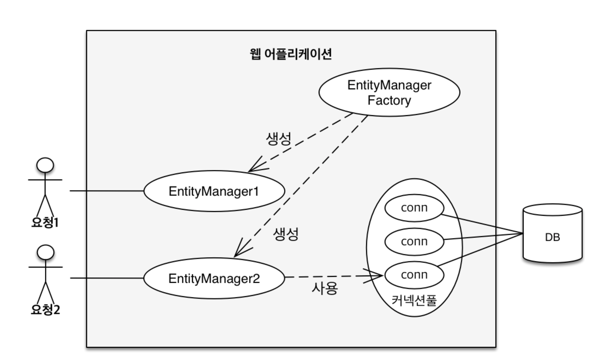
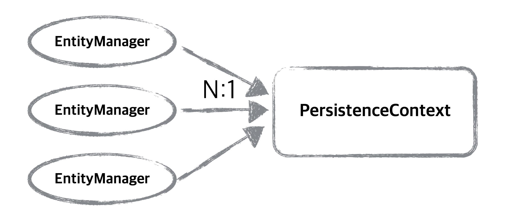
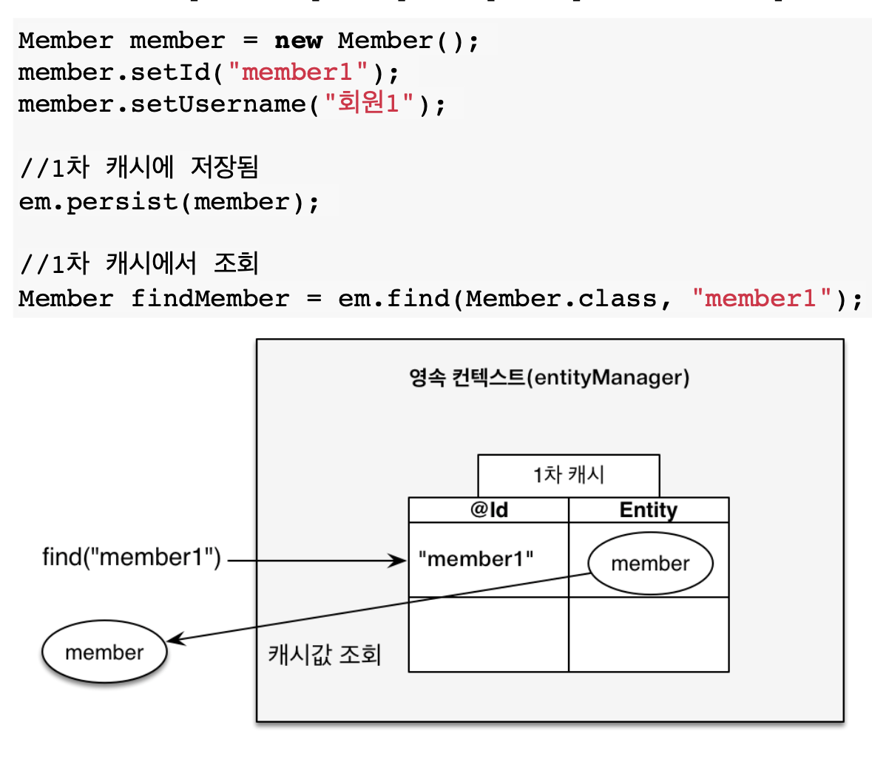

# JPA_Programming
자바 ORM 표준 JPA 프로그래밍

1. SQL 중심적인 개발의 문제점
2. 패러다임의 불일치 (객체와 디비의 불일치)
    - 관계형 디비는 데이터를 잘 정규화해서 보관하는게 목표
    - 객체는 속성과 기능을 잘 캡슐화해서 사용하는게 목표
      객체를 SQL로 결국엔 변환해서 코드를 짜야된다.

# JPA
- Java Persistence API (자바 진영의 ORM 기술 표준)
- ORM?
    - Object-relational mapping(객체 관계 매핑)
    - 객체는 객체대로 설계하고 관계형 디비는 관계형 디비대로 설계
- 인터페이스의 모음


## JPA 동작 - 저장

- JPA가 멤버 객체를 분석해 적절한 SQL 쿼리를 생성 후 JDBC API를 생성해서 Insert

## JPA를 왜 사용해야 하는가?
- 유지보수 : 기존코드의 필드 변경시 모든 SQL을 수정해야한다.
- 패러다임의 불일치 해결
- 동일한 트랙잭션에서 조회한 엔티티는 같음을 보장

## 영속성 컨텍스트 (EntityManager)
- 영속성 컨텍스트? 
  - 엔티티를 영구 저장하는 환경


- EntityManagerFactory에서 고객의 요청이 올때마다 EntityManager를 생성
- EntityManager는 내부적으로 데이터 베이스 커넥션을 사용해서 디비를 사용. EntityManager를 통해서 영속성 컨텍스트에 접근


- J2EE, 스프링 프레임워크와 같은 컨테이너 환경에서 EntityManager와 영속성 컨텍스트가 N:1로 매핑

### 엔티티의 생명주기
1. 비영속 (new/transient)
   - 영속성 컨텍스트와 전혀 관계가 없는 새로운 상태
``` java
// 단순히 객체를 생성한 상태(비영속),
Member member = new Member();
member.setId("member1");
member.setUsername("회원1");
```

2. 영속 (managed)
    - 영속성 컨텍스트에 관리되는 상태
``` java
// 단순히 객체를 생성한 상태(비영속),
Member member = new Member();
member.setId("member1");
member.setUsername("회원1");

EntityManager em = emf.createEntityManager();
em.getTransaction().begin();

// 객체를 저장한 상태(영속), EntityManager를 통해서 member를 관리
// 영속상태가 된다고 해서 바로 db 쿼리가 날라가는게 아님
em.persist(member);
```

3. 준영속(detached)
    - 영속성 컨텍스트에 저장되었다가 분리된 상태

4. 삭제(removed)
    - 삭제된 상태

### 영속성 컨텍스트 상세 동작

- em.find() 호출시 1차 캐시를 먼저 탐색


- 1차 캐시에 데이터가 없을 경우 db에서 조회 후 1차 캐시에 저장, 그 이후 반환
- **영속성 컨텍스트는 트랜잭션 단위가 끝날때 같이 종료된다, 즉 고객의 요청이 들어와서 비즈니스 로직이 끝나면 영속 컨텍스트를 지우기 때문에 1차 캐시 데이터도 날라감.
그렇기 때문에 여러명의 고객에게 사용되는 캐시는 아님**
